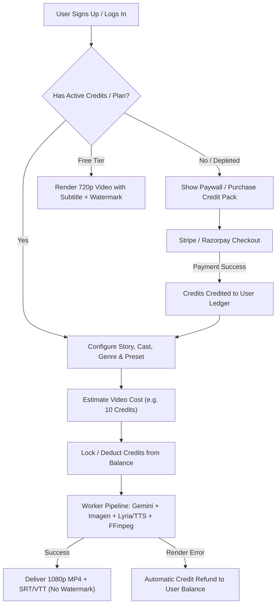

# AI Story Video Monetization & Pricing Proposal

## 1. Executive Summary & Business Opportunity

The **AI Story-to-Video Studio** is a state-of-the-art multimedia creation engine built directly into this Event Management platform. Unlike generic text-to-video tools that produce silent, isolated 4-second video clips, this engine creates end-to-end, cohesive narrative music videos featuring:
- **Multilingual Story Arc Analysis**: Narrative summaries, emotional arcs, and key themes.
- **Original Structured Song Lyrics**: Full verse, chorus, bridge, and outro in multiple global languages.
- **AI Vocals & Melodic Composition**: Lead singing vocals (male, female, duet, or custom) synthesized with genre-matched harmonic instrumentation.
- **Cast Consistency & Director Guidelines**: Character preservation across scenes with tailored directorial rules.
- **Synchronized Scene Breakdowns**: Exact time-coded lyric-to-scene matching.
- **Multi-Device Aspect Ratio Rendering**: Standard 16:9 widescreen, 9:16 vertical (TikTok/Reels/Shorts), 4:3 tablet, and 1:1 square.
- **Dual Synchronized Subtitles**: Standard SubRip (`.srt`) and W3C WebVTT (`.vtt`) files with native embedded player Closed Captions (CC).

### The Strategic Event Advantage
Event organizers (weddings, corporate conferences, concerts, galas, college festivals) already rely on the platform for ticketing, guest lists, and QR check-ins. By offering AI video generation natively, organizers can:
1. **Pre-Event**: Generate promotional teasers (30s) to drive ticket sales and hype on Instagram, TikTok, and WhatsApp.
2. **Post-Event**: Generate celebration aftermovies and anthems (60s–180s) to celebrate attendees and build community memory.

---

## 2. Cost of Goods Sold (COGS) Analysis per Video

The operational cost to generate an AI story video consists of 8 distinct layers. Costs vary based on whether the video uses **Standard Cinematic Mode** (Imagen 3 high-res frames with FFmpeg dynamic motion and pan/zoom) or **Ultra Motion Mode** (generative AI video clips per scene via Veo / Replicate).

### Detailed Model & Resource Costs

| Pipeline Stage | Model / Service | Pricing Basis | Typical Cost per Unit |
| :--- | :--- | :--- | :--- |
| **1. Story Analysis** | Gemini 2.5 Flash / 1.5 Flash | $0.075 / 1M input tokens<br>$0.30 / 1M output tokens | **~$0.0003** (negligible) |
| **2. Song Lyrics** | Gemini 2.5 Flash / 1.5 Flash | $0.075 / 1M input tokens<br>$0.30 / 1M output tokens | **~$0.0002** (negligible) |
| **3. Storyboard Breakdown** | Gemini 2.5 Flash (Cast + Guidelines) | ~2,500 total tokens | **~$0.0008** (negligible) |
| **4. Music & Vocals** | **Option A**: Google Cloud Journey/Studio TTS + Synth Chord Mix<br>**Option B**: Suno AI / Lyria 3 Pro / ElevenLabs Music | GCP: $0.000016 / char<br>Cloud AI: ~$0.05–$0.12 / song | **Option A**: ~$0.01<br>**Option B**: ~$0.08–$0.12 |
| **5. Scene Images (Frames)** | **Option A**: Pollinations AI / Free Tier<br>**Option B**: Google Imagen 3 (`imagen-3.0-generate-002`) | Free / ~$0.005<br>Vertex AI: $0.030 / image | **Option A**: $0.00<br>**Option B**: $0.03 / scene image |
| **6. Video Motion Generation** | **Option A**: FFmpeg Ken Burns / Motion Graphics<br>**Option B**: Replicate SVD / Minimax<br>**Option C**: Google Veo 2 / Gemini Omni Video | Local CPU: $0.00<br>Replicate: ~$0.03 / clip<br>Vertex AI Veo: ~$0.20–$0.35 / clip | **Option A**: $0.00<br>**Option B**: ~$0.03 / clip<br>**Option C**: ~$0.25 / clip |
| **7. Cloud Rendering & Subtitles** | FFmpeg Stitcher + WebVTT/SRT worker | Render/AWS compute (~30–90 sec) | **~$0.005 – $0.015** |
| **8. Storage & Bandwidth** | Cloudflare R2 (zero egress fees) | $0.015 / GB-month | **~$0.002 / video** |

---

## 3. Net Unit Cost by Video Duration & Quality Mode

### Mode 1: Standard Cinematic Mode
*(Google Imagen 3 photorealistic frames + dynamic camera motion + AI vocals + WebVTT subtitles)*

- **30-Second Teaser / Promo (4–5 scenes)**:
  - 5 Images: $0.15
  - AI Music & Vocals: $0.08
  - Story & Storyboard LLM: $0.002
  - FFmpeg Render & Subtitles: $0.01
  - Cloudflare R2 Storage: $0.002
  - **Total Cost per 30s Video**: **~$0.24 – $0.25**

- **60-Second Story Reel (8–10 scenes)**:
  - 10 Images: $0.30
  - AI Music & Vocals: $0.08
  - Story & Storyboard LLM: $0.003
  - FFmpeg Render & Subtitles: $0.015
  - Cloudflare R2 Storage: $0.003
  - **Total Cost per 60s Video**: **~$0.40 – $0.42**

- **180-Second (3 min) Full Music Anthem (25–30 scenes)**:
  - 25 Images: $0.75
  - Full-length AI Music & Vocals: $0.12
  - Story & Storyboard LLM: $0.005
  - FFmpeg Render & Subtitles: $0.04
  - Cloudflare R2 Storage: $0.005
  - **Total Cost per 180s Video**: **~$0.92 – $0.94**

---

### Mode 2: Ultra Motion Mode
*(Full generative AI motion video clips per scene via Replicate SVD / Google Veo 2)*

| Video Format | Scene Count | Motion Clip Cost | Base Cost (Images + Vocals) | **Total Net Cost** |
| :--- | :---: | :---: | :---: | :---: |
| **30-Second Teaser** | 5 clips | ~$0.15 (SVD) – $1.25 (Veo) | ~$0.24 | **~$0.40 – $1.50** |
| **60-Second Story Video** | 10 clips | ~$0.30 (SVD) – $2.50 (Veo) | ~$0.40 | **~$0.70 – $2.90** |
| **180-Second Full Video** | 25 clips | ~$0.75 (SVD) – $6.25 (Veo) | ~$0.90 | **~$1.65 – $7.15** |

---

## 4. Proposed Pricing Plans & Revenue Models

### A. The Credit Model (Internal Currency)
To offer predictable pricing across different video lengths and formats, all video generation is measured in **Studio Credits**:
- Internal baseline valuation: **1 Credit = ~$0.10**
- **Credit Burn Rate**:
  - 30-Second Teaser (Standard): **5 Credits**
  - 60-Second Reel (Standard): **10 Credits**
  - 180-Second Full Music Video (Standard): **25 Credits**
  - Ultra Motion Generative Upgrade: **+10 to +30 Credits**

---

### B. SaaS Subscription Plans (Recurring Monthly / Annual)

```
+---------------------------------------------------------------------------------------------------+
|                                      SUBSCRIPTION TIERS                                           |
+-------------------+-------------------+---------------------------+-------------------------------+
| Free / Trial      | Creator           | Event Pro (Recommended)   | Agency / Enterprise           |
| $0                | $19 / month       | $49 / month               | $149 / month                  |
| (10 Credits once) | (100 Credits/mo)  | (300 Credits/mo)          | (1,000 Credits/mo)            |
+-------------------+-------------------+---------------------------+-------------------------------+
| * 720p Watermark  | * 1080p Full HD   | * All Creator features    | * All Event Pro features      |
| * 1 Teaser/Reel   | * No Watermark    | * Ultra Motion clips      | * White-label exports         |
| * Standard Audio  | * All Aspect      | * Cast Bible consistency  | * Custom voice cloning        |
| * Evaluation only |   Ratios (4)      | * Director guidelines     | * Team seats (5 accounts)     |
|                   | * SRT & VTT       | * Priority queue render   | * Dedicated render worker     |
|                   |   Downloads       | * Commercial license      | * Direct API access           |
+-------------------+-------------------+---------------------------+-------------------------------+
```

---

### C. Pay-Per-Video / On-Demand Packs (No Monthly Commitment)
Ideal for one-time hosts (e.g., weddings, birthdays, annual reunions):

| Product | Retail Price | Deliverables | COGS | **Gross Profit** | **Margin** |
| :--- | :---: | :--- | :---: | :---: | :---: |
| **Single Teaser (30s)** | **$9.99** | 1080p 30s Promo Video + SRT/VTT Subtitles | ~$0.25 | **$9.74** | **97.5%** |
| **Story Reel (60s)** | **$19.99** | 1080p 60s Video (9:16 Reels/Shorts or 16:9) | ~$0.42 | **$19.57** | **97.9%** |
| **Full Event Anthem (3 min)** | **$39.99** | 1080p Full 3-minute Video + Audio Track + Subtitles | ~$0.94 | **$39.05** | **97.6%** |
| **Event Story Bundle** | **$59.99** | 1 Teaser (30s) + 1 Aftermovie (3 min) + Cast Consistency | ~$1.20 | **$58.79** | **98.0%** |

---

### D. Integrated Event Management Bundles
Because the platform provides QR Ticketing, Guest Check-In, and Staff Scanning:

- **"Event Pro Package" ($79 per event)**:
  - Up to 500 QR Code Tickets with Gate Check-In & Staff Scanner access.
  - 1 AI Teaser Promo Video (30s) to market ticket launch on social media.
  - 1 AI Celebration Recap Video (3 min) sent to all checked-in attendees post-event.
  - **Marginal COGS**: ~$1.20
  - **Net Profit**: **~$77.80 per event** (98% margin).

---

## 5. Financial Projections

### Scenario A: 100 Active Monthly Paying Customers
- 50 Creator Subscriptions ($19/mo) = **$950**
- 35 Event Pro Subscriptions ($49/mo) = **$1,715**
- 15 Agency Subscriptions ($149/mo) = **$2,235**
- **Monthly Recurring Revenue (MRR)**: **$4,900 / month** ($58,800 ARR)
- **Total AI & Compute COGS**: ~$380 – $520 / month
- **Net Monthly Gross Profit**: **~$4,380 – $4,520 / month (89% – 92% Gross Margin)**

### Scenario B: 500 Active Monthly Customers (Scale Phase)
- 250 Creator Subscriptions ($19/mo) = **$4,750**
- 180 Event Pro Subscriptions ($49/mo) = **$8,820**
- 70 Agency Subscriptions ($149/mo) = **$10,430**
- **Monthly Recurring Revenue (MRR)**: **$24,000 / month** ($288,000 ARR)
- **Total AI & Compute COGS**: ~$1,800 – $2,500 / month
- **Net Monthly Gross Profit**: **~$21,500 – $22,200 / month (90%+ Gross Margin)**

---

## 6. Architecture & Implementation Roadmap



### Key Technical Deliverables:
1. **User Credit Ledger Database Schema (`UserCreditBalance`)**:
   - `userId`: reference to User.
   - `creditsAvailable`: current usable balance.
   - `lifetimeEarned`: total credits bought/granted.
   - `ledger`: audit log recording each transaction (type: `purchase`, `deduction`, `refund`, `monthly_grant`).
2. **Payment Gateway Integration**:
   - Integrate **Stripe Billing** (or **Razorpay** / **LemonSqueezy**).
   - Implement webhooks (`checkout.session.completed`, `invoice.payment_succeeded`) to grant credits instantly.
3. **Free Tier Watermarking**:
   - In [`apps/api/src/workers/index.js`](file:///var/www/html/ai-projects/apps/api/src/workers/index.js), add conditional FFmpeg watermark filtering for free-tier users:
     `-vf "drawtext=text='Created with EventStudio.ai':x=w-tw-20:y=h-th-20:fontsize=24:fontcolor=white@0.7"`.
4. **Failure Safeguard**:
   - If an AI API call fails or FFmpeg worker encounters an unrecoverable error, the worker triggers an automatic refund of deducted credits back to the user's ledger.
5. **Quality Gating**:
   - 720p resolution for Free tier.
   - 1080p Full HD for Creator & Event Pro tiers.
   - Optional 4K upscaling for Agency tier.
